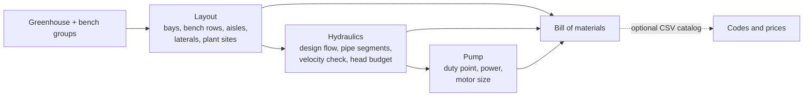

# Hydroponics Projects Maker

[](https://github.com/nicholascomuni/hydroponics-projects-maker/actions/workflows/ci.yml)
[](LICENSE)


Sizing toolkit for NFT hydroponic greenhouses. It takes the greenhouse footprint and bench mix and
works out the bench layout, the hydraulic design of the nutrient-solution network (Hazen-Williams
friction with the Christiansen factor for pipes with outlets), the pump duty point and motor size,
and a bill of materials.

A personal project that started as a notebook for sizing greenhouse projects and is now a small
tested Python package with a CLI and a worked example.

## Highlights

The example greenhouse (51 m x 48 m, 72 benches, 45,416 plant sites, 5 irrigation sectors), from
[`notebooks/greenhouse_design_walkthrough.ipynb`](notebooks/greenhouse_design_walkthrough.ipynb):

| main / lateral pipe | max velocity | total head | shaft power | motor |
|---|---|---|---|---|
| DN50 / DN32 (original choice) | 2.93 m/s (flagged) | 26.9 m | 1.96 kW | 3 cv |
| **DN60 / DN40** | 1.99 m/s | **14.8 m** | 1.08 kW | **1.5 cv** |
| DN75 / DN40 | 1.80 m/s | 10.2 m | 0.74 kW | 1.5 cv |

The velocity check flags the original DN50/DN32 piping as undersized. One pipe size up in each line
roughly halves the pump head and motor size for each of the five sector pumps.

## What it computes



| step | what it does | infeasible input |
|---|---|---|
| Layout | bays, bench rows, aisle width, channel spacing, laterals per sector, plant sites per crop | `DesignError` (benches don't fit, aisle below minimum) |
| Hydraulics | design flow, friction per segment, fittings allowance, static heads, total dynamic head | `DesignWarning` when a velocity is outside 0.5-2.0 m/s, with the smallest pipe size that fixes it |
| Pump | hydraulic and shaft power, next standard motor size | `DesignError` above 30 cv |
| BOM | benches, supply piping, drainage, pump stations, consumables | `ValueError` for inconsistent items |

## Engineering background

**Glossary.** *NFT* (Nutrient Film Technique): plants sit in holes along shallow channels and a thin
film of nutrient solution flows through them by gravity back to a reservoir. A *bench* is a set of
parallel channels on trestles. A *bay* is the span between two lines of greenhouse posts. A
*sector* is an independent circuit with its own pump and reservoir. The *manifold* runs along the
greenhouse and feeds *laterals*, which cross a bay and feed its benches. Heads are in metres of
water column (m); motor sizes are also given in cv (metric horsepower, 735.5 W), the unit used in
Brazilian pump catalogues.

### Layout

- Bays that fit in the width: $n_{bays} = \lfloor W / w_{bay} \rfloor$; bench rows = $n_{bays} \times$ benches per bay.
- Aisle width: $a = (w_{bay} - k \, w_{bench}) / k$ for $k$ benches per bay (with $k+1$ aisles when there is a single bay).
- Channel spacing (centre to centre) for $n$ channels of width $w_c$ on a bench of width $W_b$: $s = (W_b - n\,w_c)/(n-1) + w_c$.
- Plant sites = channels x bench length x holes per metre of the channel profile.
- One lateral per group of benches side by side in a bay; laterals per sector are rounded up.

### Design flow

$$Q_{total} = N_{channels} \cdot q_{channel}, \qquad Q_{sector} = \frac{Q_{total}}{n_{sectors}} \cdot SF$$

with $q_{channel} = 1.5$ L/min and a safety factor $SF = 1.3$ by default. The lateral is sized for
the most demanding bench type (the one with most channels) on all its outlets.

### Friction loss: Hazen-Williams

$$h_f = 10.646 \; L \; \frac{(Q/C)^{1.852}}{D^{4.87}}$$

SI form with $Q$ in m³/s, inner diameter $D$ in m, $L$ in m and $C = 140$ for PVC. Inner diameters
for DN20-DN110 PVC solvent-weld pipe (ABNT NBR 5648) are built in; check them against your
manufacturer's datasheet.

### Pipes with outlets: Christiansen factor

A manifold or lateral loses flow at each outlet, so its friction is lower than that of a plain pipe
carrying the inlet flow over its whole length. For $N$ equally spaced outlets, with the first one
spacing away from the inlet and $m = 1.852$:

$$F = \frac{1}{m+1} + \frac{1}{2N} + \frac{\sqrt{m-1}}{6N^2}, \qquad h_{f,\,outlets} = F \cdot h_f$$

$F \approx 1$ for one outlet and tends to $1/(m+1) \approx 0.351$ for many (tests check it against
the published table: 0.639 for 2, 0.457 for 5, 0.402 for 10 outlets).

### Head budget and velocity check

The path to the farthest bench is modelled as three segments:

1. **Feed line**: greenhouse width + 10 m at the full sector flow ($F = 1$).
2. **Manifold**: greenhouse length, one outlet per lateral in the sector.
3. **Lateral**: one bay wide, one outlet per bench.

$$TDH = (1 + k_{minor}) \sum h_f + h_{bench} + h_{filter} + h_{suction} + i_{terrain} \, L_{greenhouse}$$

with a 10 % fittings/valves allowance $k_{minor}$, 1.2 m bench height, 1.5 m filter loss and 1.5 m
suction by default. The inlet velocity of each segment, $v = 4Q/(\pi D^2)$, must fall in
0.5-2.0 m/s: faster flow means steep friction losses and water-hammer risk (irrigation practice
often uses 1.5 m/s for PVC), slower flow means an oversized, more expensive pipe.

### Pump

$$P_{hyd} = \rho g Q H, \qquad P_{shaft} = P_{hyd} / \eta$$

with $\eta = 0.6$ by default; the motor is the next standard size (0.25 ... 30 cv). The result is a
duty point to check against a manufacturer's pump curve, not a pump model.

## Quickstart

```bash
git clone https://github.com/nicholascomuni/hydroponics-projects-maker.git
cd hydroponics-projects-maker
python -m venv .venv && source .venv/bin/activate
pip install -r requirements-dev.txt -e .

# the example greenhouse from the notebook
python -m hydroponics design --config examples/greenhouse_51x48.toml

# a 50 m x 20 m greenhouse filled with default grow-out benches, 2 sectors, bigger main pipe
python -m hydroponics design --length 50 --width 20 --sectors 2 --main-pipe 60 --bom
```

Example output (`--config examples/greenhouse_51x48.toml`):

```text
Greenhouse design summary
=========================
Footprint        51 m x 48 m (2,448 m²), 6 bays of 8 m, 5 sector(s)
Benches          72 in 18/18 bench rows, 686 NFT channels, 24 laterals
Aisle width      0.87 m (minimum 0.53 m)
    61 x Lettuce (grow-out)     12 x 1.8 m, 8 x PS85 channels, channel spacing 24.9 cm, 22,448 plant sites
    11 x Lettuce (nursery)      12 x 1.8 m, 18 x PS55 channels, channel spacing 10.3 cm, 22,968 plant sites
Plant sites      45,416 total

Hydraulics (per sector)
Nominal flow     61.74 m³/h for the whole greenhouse (686 channels x 1.5 L/min)
Design flow      16.05 m³/h per sector (x1.3 safety factor)
  Feed line  DN50   L= 58.0 m  Q= 16.05 m³/h  v=2.93 m/s  hf=11.72 m  (plain pipe)
  Manifold   DN50   L= 51.0 m  Q= 16.05 m³/h  v=2.93 m/s  hf= 4.71 m  (5 outlets, F=0.457)
  Lateral    DN32   L=  8.0 m  Q=  6.32 m³/h  v=2.89 m/s  hf= 1.44 m  (3 outlets, F=0.534)
Friction         17.86 m + 1.79 m fittings
Static/component 7.26 m
Total head       26.90 m

Pump (one per sector)
Duty point       16.05 m³/h @ 26.9 m
Power            hydraulic 1.18 kW, shaft 1.96 kW at 60% efficiency
Motor            3 cv (2.21 kW) x 5

Bill of materials: 28 line items

Warnings
  - Feed line: velocity 2.93 m/s is above 2 m/s; use DN60 or larger
  - Manifold: velocity 2.93 m/s is above 2 m/s; use DN60 or larger
  - Lateral: velocity 2.89 m/s is above 2 m/s; use DN40 or larger
```

From Python:

```python
from hydroponics import Bench, BenchGroup, DesignInputs, Greenhouse, HydraulicSettings, design_greenhouse

design = design_greenhouse(
    DesignInputs(
        greenhouse=Greenhouse(length_m=51, width_m=48, bay_width_m=8, benches_per_bay=3, sectors=5),
        benches=(
            BenchGroup(Bench(12, 1.8, channels=8, profile="PS85"), count=61, crop="grow-out"),
            BenchGroup(Bench(12, 1.8, channels=18, profile="PS55"), count=11, crop="nursery"),
        ),
        hydraulics=HydraulicSettings(main_pipe_mm=60, lateral_pipe_mm=40, terrain_slope_pct=6),
    )
)
print(design.summary())
design.hydraulics.segments_frame()  # per-segment velocity, F and head loss
design.bom_frame()  # bill of materials as a DataFrame
```

## Configuration

Design assumptions are parameters with documented defaults. Product codes, prices and pump models
are not in the code: codes and prices come from an optional catalog, the pump model is a parameter.

| where | parameters |
|---|---|
| `Greenhouse` / `[greenhouse]` | `length_m`, `width_m`, `bay_width_m` (8), `benches_per_bay` (3), `sectors` (1), `min_aisle_width_m` (0.53) |
| `Bench` / `[[benches]]` | `length_m`, `width_m`, `channels`, `profile` (`PS55`, `PS65`, `PS85` or a custom `ChannelProfile`), plus `count` and `crop` |
| `HydraulicSettings` / `[hydraulics]` | pipe sizes (50/32/25 mm), `flow_per_channel_l_min` (1.5), `flow_safety_factor` (1.3), `feed_line_extra_m` (10), `bench_height_m` (1.2), `filter_head_m` (1.5), `suction_head_m` (1.5), `terrain_slope_pct` (0), `minor_loss_factor` (0.10), `hazen_williams_c` (140), `velocity_range_m_s` (0.5, 2.0) |
| `PumpStationSettings` / `[pump]` | `efficiency` (0.6), `model` (optional BOM label, e.g. a commercial pump name), `reservoir_volume_l` (3000) |

See [`examples/greenhouse_51x48.toml`](examples/greenhouse_51x48.toml) for the file format.

## Product catalog (optional)

Product codes and prices are kept out of the repository. Everything runs without them; to attach
codes and prices to the BOM, pass your own CSV with `--catalog path.csv` or `Catalog.from_csv(path)`.

| column | required | meaning |
|---|---|---|
| `product` | yes | BOM product key (see below) |
| `code` | no | supplier / ERP code |
| `description` | no | free text |
| `unit_price` | no | price per BOM unit; `.` or `,` decimal mark |

Delimiter (`,` or `;`) and header case are detected automatically. With `unit_price`, the BOM gets a
`total_price` column. Products missing from the catalog keep empty columns and are listed in one
log warning. BOM product keys follow these patterns:

| category | keys |
|---|---|
| Benches | `bench-trestle-{width}m`, `inlet-trestle-{channels}ch-{width}m`, `collector-gutter-{channels}ch-{width}m`, `nft-channel-{profile}`, `channel-end-cap-{profile}`, `channel-clip-{profile}`, `screw` |
| Supply piping | `pvc-pipe-{dn}mm`, `pvc-elbow-{dn}mm`, `pvc-reducing-tee-{dn}x{dn}mm`, `pvc-cap-{dn}mm` |
| Drainage | `drain-pipe-75mm`, `drain-elbow-75mm`, `drain-tee-75mm` |
| Pump station | `pump-fittings-kit-{dn}mm`, `centrifugal-pump-{cv}cv` (or the configured `model`), `pump-control-panel-{cv}cv`, `reservoir-{litres}l` |
| Consumables | `pvc-solvent-cement-170g`, `sandpaper-sheet` |

For example `bench-trestle-1.8m`, `nft-channel-PS85`, `pvc-reducing-tee-60x40mm`.

## Project structure

```text
.
├── src/hydroponics/
│   ├── layout.py        # channel profiles, benches, greenhouse, layout validation
│   ├── hydraulics.py    # Hazen-Williams, Christiansen factor, pipe segments, head budget
│   ├── pump.py          # hydraulic/shaft power, motor size
│   ├── bom.py           # BOM aggregation and quantity take-off
│   ├── catalog.py       # optional CSV product catalog
│   ├── design.py        # end-to-end design, summary, TOML loader
│   └── cli.py           # `python -m hydroponics design ...`
├── notebooks/greenhouse_design_walkthrough.ipynb
├── examples/greenhouse_51x48.toml
├── tests/
├── pyproject.toml
└── requirements*.txt    # pinned versions used in CI
```

## Tests

```bash
ruff check . && ruff format --check .
pytest
jupyter nbconvert --to notebook --execute --output-dir /tmp notebooks/greenhouse_design_walkthrough.ipynb
```

The suite (50 tests, runs offline in under a second) covers Hazen-Williams against a hand-computed
reference and its scaling laws, the Christiansen factor against the published table, layout counts
and validation errors, BOM aggregation and catalog pricing, pump sizing, the TOML loader and the CLI.
CI runs lint, tests, a CLI smoke test and the notebook on Python 3.11 and 3.12.

## Changes from the original notebook

The first version was a single Portuguese notebook with the classes inline, a product CSV that was
never committed (so it could not run) and a few modelling shortcuts. Besides the refactor, the
hydraulic model changed in these places:

- The feed line (width + 10 m) is a plain pipe at full flow; the Christiansen reduction now applies
  only to the manifold. The original lumped both into one 109 m pipe with the factor applied
  throughout, which underestimated friction.
- The lateral carries the flow of the benches it actually feeds (most demanding bench type), instead
  of a third of the sector flow.
- Outlet counts are whole numbers (laterals per sector rounded up).
- The 10 % allowance applies to friction only, not to static heads.
- Pipe velocity, previously computed and discarded, is now checked; the minimum-aisle check raises
  an error instead of printing a number.
- Lateral pipe take-off uses laterals x bay width, consistent with the hydraulic model.

With the original lumped formulas, the package's functions reproduce the notebook's 20.33 m head
(20.32 m without intermediate rounding; see section 3 of the walkthrough). The segmented model
gives 26.9 m for the same pipes.

## Limitations and next steps

- Pump selection stops at the duty point and motor size; matching against real pump curves and an
  NPSH check are not implemented.
- Pipe-size choice is manual (the velocity check suggests the smallest size that fits); an
  optimiser trading pipe cost against pump energy cost would use the priced BOM.
- Bench rows are not shared between bench lengths, and every sector is assumed to be the same
  size; very irregular layouts need a finer model.
- Only the NFT channel profiles of the original project are built in (hole counts per 6 m bar);
  others can be passed as `ChannelProfile`.
- The quantity take-off rules (one trestle per metre, drainage length factor 0.9, consumables per
  200 m²) are the original project's rules of thumb.

## Related

[LMI](https://github.com/nicholascomuni/LMI) is a separate library of mine for bills of materials.
This project does not depend on it.

## License

[MIT](LICENSE)
